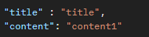

일정 API 명세서
=========

[홈으로](../README.md)

---
## 링크 

---
[일정 생성](#일정-생성) 
[일정 조회](#일정-조회) 
[특정 일정 조회](#특정-일정-조회) 
[일정 수정](#일정-수정) 
[일정 삭제](#일정-삭제) 
[내 일정 조회](#내-일정-조회)

---

## 일정 생성

### 1. 기능 설명
일정을 생성한다. 
작성 유저 id, 제목, 내용을 입력 받는다.
### 2. Method
`post`
### 3. URL
`/schedule`
### 4. 요청

### 5. 응답
x
### 6. 상세 코드
**200** : 정상 등록 
**400** : 잘못 된 입력 
**401** : 유저 id 조회 불가

[맨 위로](#top)

---

## 일정 조회

### 1. 기능 설명
일정을 조회한다.
### 2. Method
`get`
### 3. URL
`/schedule`
### 4. 요청

### 5. 응답

### 6. 상세 코드
**200** : 정상 조회 
**400** : 잘못 된 입력 

[맨 위로](#top)

---

## 특정 일정 조회

### 1. 기능 설명
특정 일정을 조회
### 2. Method
`get`
### 3. URL
`/schedule/{id}`
### 4. 요청
url에 id 값을 담아서 전달
### 5. 응답
x
### 6. 상세 코드
**200** : 정상 수정 
**400** : 잘못 된 입력 
**402** : 일정 id 조회 불가

[맨 위로](#top)

---

## 일정 수정

### 1. 기능 설명
일정을 수정한다.
### 2. Method
`put`
### 3. URL
`/schedule/{id}`
### 4. 요청
url에 id값 전달, body에 양식 전달 

### 5. 응답
x
### 6. 상세 코드
**200** : 정상 수정 
**400** : 잘못 된 입력 
**402** : 일정 id 조회 불가

[맨 위로](#top)

---

## 일정 삭제

### 1. 기능 설명
일정을 삭제한다.
### 2. Method
`delete`
### 3. URL
`/schedule/{id}`
### 4. 요청
url에 id 값 전달
### 5. 응답
x
### 6. 상세 코드
**200** : 정상 삭제 
**400** : 잘못 된 입력 
**402** : 일정 id 조회 불가

[맨 위로](#top)

---

## 내 일정 조회

### 1. 기능 설명
로그인 한 유저가 작성한 일정을 가져온다.
### 2. Method
`get`
### 3. URL
`/schedule/mine`
### 4. 요청
x
### 5. 응답
x
### 6. 상세 코드
**200** : 정상 삭제 
**400** : 잘못 된 입력 
**402** : 일정 id 조회 불가

[맨 위로](#top)

---