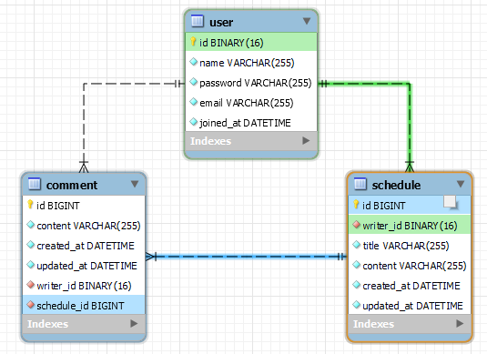

# schedule (일정 관리 앱)

### 프로젝트 개요
사용자의 일정을 관리하고, 댓글을 작성할 수 있는 프로그램이다.

### 프로젝트 설명
사용자의 회원 가입, 정보 수정이 가능하고 회원은 일정 등록이 가능하다.
일정은 다른 사용자들도 열람할 수 있고, 댓글을 남길 수 있다.
일정, 댓글의 수정과 조회, 삭제 또한 모두 가능하다.

### 작업 기간
2024-12-13 ~ 2024-12-19

### 사용 기술
> Java17, Spring framework, My-SQL, JPA

### API 명세서

[일정 API명세서](docs/ScheduleApi.md) 
[유저 API 명세서](docs/UserApi.md) 
[댓글 API 명세서](docs/CommentApi.md) 
[인증 API 명세서](docs/AuthApi.md)

### E-R 다이어그램

