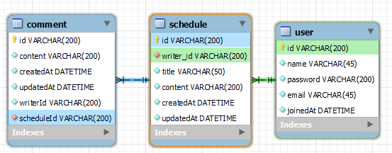

# schedule (일정 관리 앱)

### 사용 기술
> Java17, Spring framework, My-SQL, JPA

### API 명세서

[일정 API명세서](docs/ScheduleApi.md) 
[유저 API 명세서](docs/UserApi.md) 
[댓글 API 명세서](docs/CommentApi.md)

### E-R 다이어그램

