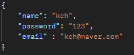
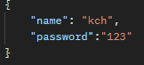

# 인증 API 명세서
[홈으로](../README.md)

---
## 링크 

---
[회원 가입](#회원-가입) 
[로그인](#로그인) 
[로그아웃](#로그아웃) 

---

### 회원 가입

### 1. 기능 설명
새로운 사용자를 등록한다.
### 2. Method
`post`
### 3. URL
`/auth/signup`
### 4. 요청

### 5. 응답
x
### 6. 상세 코드
**200** : 정상 등록 
**400** : 잘못 된 입력 

[맨 위로](#top)

---

### 로그인

### 1. 기능 설명
회원 정보로 로그인을 시도한다.
### 2. Method
`post`
### 3. URL
`/auth/login`
### 4. 요청

### 5. 응답
x
### 6. 상세 코드
**200** : 정상 로그인 
**400** : 잘못 된 입력 
**401** : 회원 id 조회 불가

[맨 위로](#top)

---

### 로그아웃

### 1. 기능 설명
로그아웃을 진행한다.
### 2. Method
`post`
### 3. URL
`/auth/logout`
### 4. 요청
x
### 5. 응답
x
### 6. 상세 코드
**200** : 정상 로그아웃 
[맨 위로](#top)

---