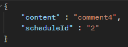
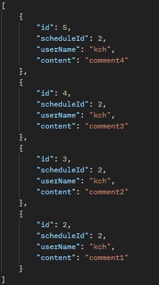
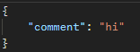

# 댓글 API 명세서
[홈으로](../README.md)

---
## 링크 

---
[댓글 작성](#댓글-작성) 
[댓글 조회](#댓글-조회) 
[댓글 수정](#댓글-수정) 
[댓글 삭제](#댓글-삭제) 

---

### 댓글 작성

### 1. 기능 설명
일정에 댓글을 추가한다.
### 2. Method
`post`
### 3. URL
`/comment`
### 4. 요청

### 5. 응답
x
### 6. 상세 코드
**200** : 정상 등록 
**400** : 잘못 된 입력 
**401** : 회원 id 조회 불가
**402** : 일정 id 조회 불가

[맨 위로](#top)

---

### 댓글 조회

### 1. 기능 설명
일정의 댓글을 조회한다.
### 2. Method
`get`
### 3. URL
`/comment/{id}`
### 4. 요청
url에 scheduleId를 전달
### 5. 응답

### 6. 상세 코드
**200** : 정상 조회 

[맨 위로](#top)

---

### 댓글 수정

### 1. 기능 설명
댓글을 수정한다.
### 2. Method
`put`
### 3. URL
`/comment/{id}`
### 4. 요청
url에 수정 할 댓글 id 전달, body에 수정 양식 전달 

### 5. 응답
x
### 6. 상세 코드
**200** : 정상 수정 
**400** : 잘못 된 입력 
**401** : 회원 id 조회 불가
**402** : 일정 id 조회 불가

[맨 위로](#top)

---

### 댓글 삭제

### 1. 기능 설명
댓글을 삭제한다.
### 2. Method
`delete`
### 3. URL
`/comment/{id}`
### 4. 요청
url에 삭제 할 id 값 전달
### 5. 응답
x
### 6. 상세 코드
**200** : 정상 수정 
**400** : 잘못 된 입력 
**403** : 댓글 id 조회 불가

[맨 위로](#top)

---