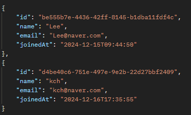
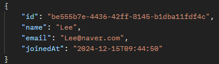
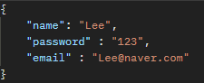

# 사용자 API 명세서
[홈으로](../README.md)

---
## 링크 

---
[모든 회원 조회](#모든-회원-조회) 
[특정 회원 조회](#특정-회원-조회) 
[회원 수정](#회원-수정) 
[회원 탈퇴](#회원-탈퇴) 

---

### 모든 회원 조회

### 1. 기능 설명
모든 회원을 조회한다.
### 2. Method
`get`
### 3. URL
`/user/all`
### 4. 요청
x
### 5. 응답

### 6. 상세 코드
**200** : 정상 조회 

[맨 위로](#top)

---

### 특정 회원 조회

### 1. 기능 설명
특정 회원을 조회한다.
### 2. Method
`get`
### 3. URL
`/user/{id}`
### 4. 요청
id를 url에 전달
### 5. 응답

### 6. 상세 코드
**200** : 정상 조회 

[맨 위로](#top)

---

### 회원 수정

### 1. 기능 설명
회원 정보를 수정한다.
### 2. Method
`put`
### 3. URL
`/user/{id}`
### 4. 요청
url에 id 값 전달, body에 수정 양식 

### 5. 응답
x
### 6. 상세 코드
**200** : 정상 수정 
**400** : 잘못 된 입력 
**401** : 회원 id 조회 불가

[맨 위로](#top)

---

### 회원 탈퇴

### 1. 기능 설명
회원 정보를 삭제한다.
### 2. Method
`delete`
### 3. URL
`/user/{id}`
### 4. 요청
url에 id 값 전달
### 5. 응답
x
### 6. 상세 코드
**200** : 정상 등록 
**400** : 잘못 된 입력 
**401** : 회원 id 조회 불가

[맨 위로](#top)

---